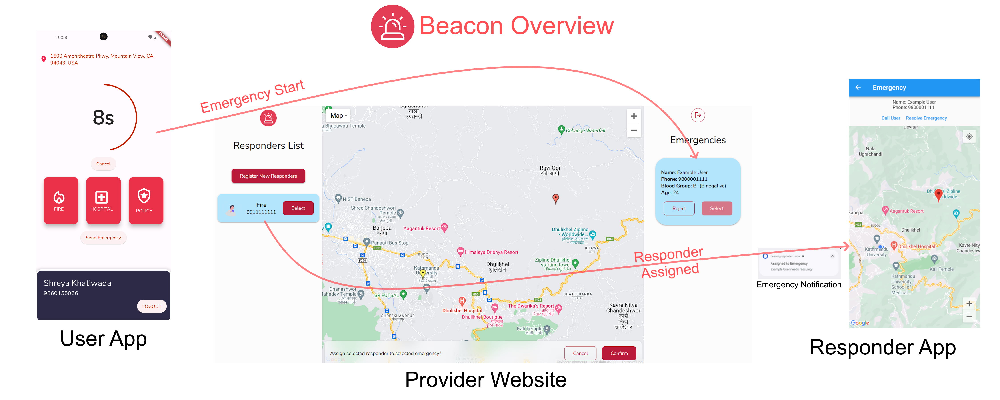

# Beacon

Beacon is a real-time system designed to connect emergency service providers with those in need.

In Beacon, there are three entities: **user**, **coordinator** and **responder**. The user initiates the emergency. This emergency is shown on the coordinator's screen, who can then pick the most suitable responder for the situation. The responder is sent a notification and can view the user's live location.

# Features
- Launching user application automatically triggers emergency countdown
- System automatically picks the nearest emergency provider
- Live location of responders shown to user and coordinator.
- Supports three different emergency provider types: Fire, Medical and Police
- Medical information entered during registration is provided to coordinator as additional context

# Objectives

The objectives of Beacon are:
- To improve the response time of emergency services in Nepal, especially in rural areas. 
- To update users in real-time on the status of their emergency request.
- To help emergency service providers navigate to the location of the emergency using real-time maps.
